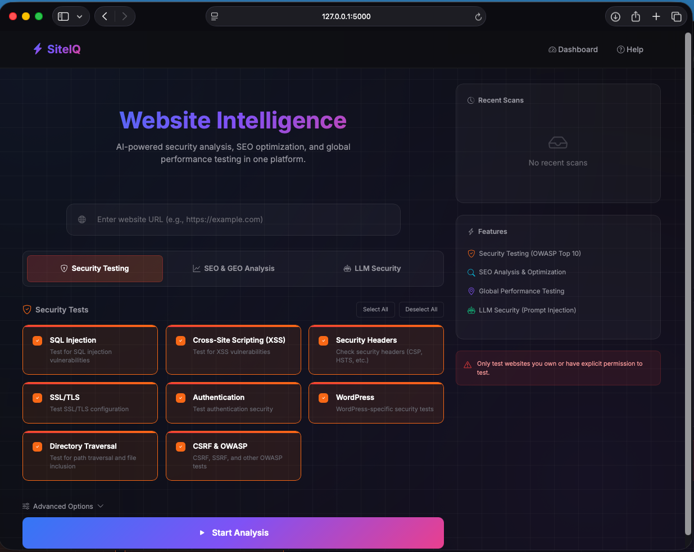
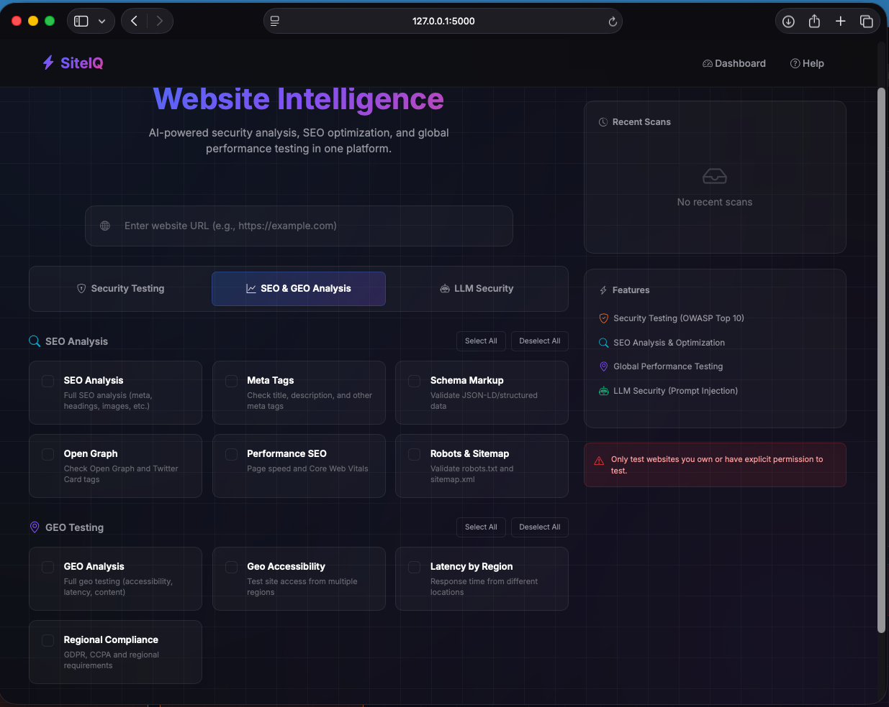
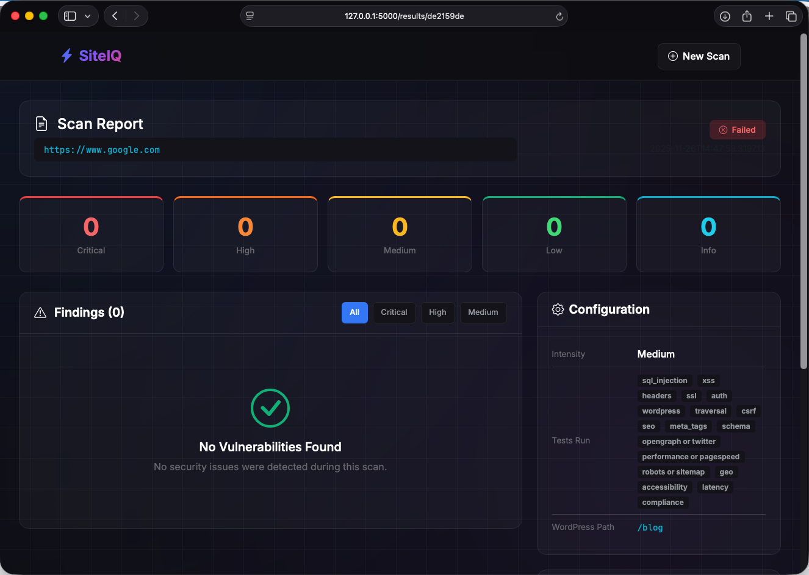
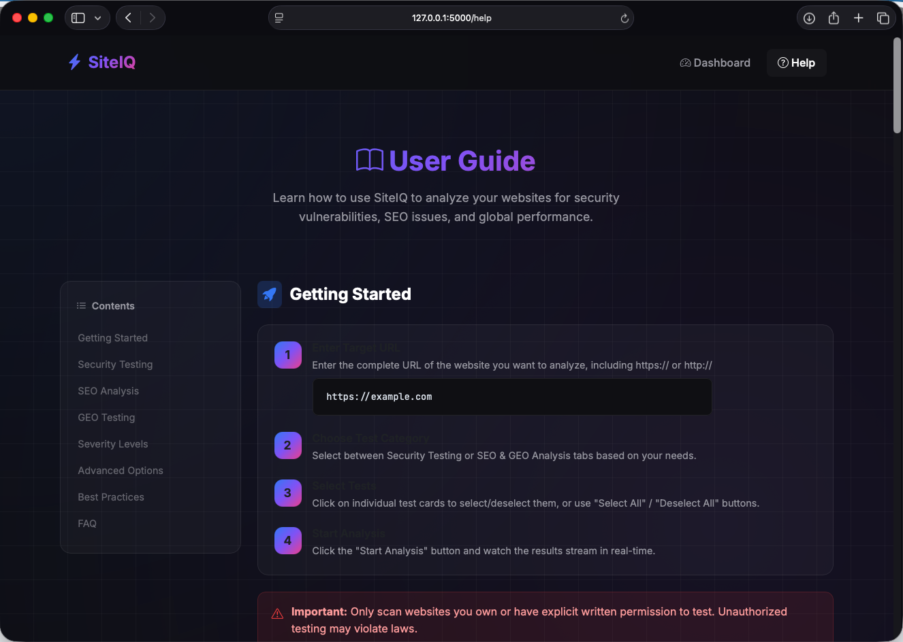
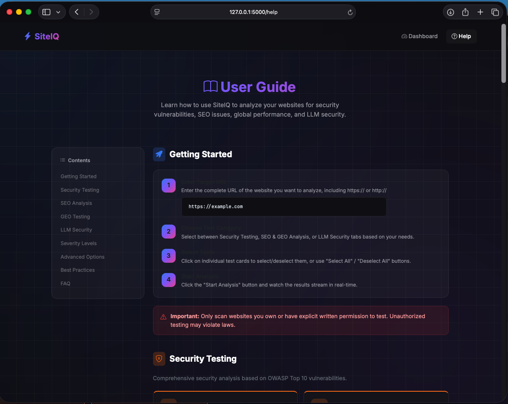

# SiteIQ - Website Intelligence Platform

A comprehensive website analysis and security testing platform featuring security testing, SEO analysis, GEO testing, and LLM security testing.

## ⚠️ Security Notice

**This application is designed to run LOCALLY (localhost) only.**

Do NOT expose this application to the internet without proper security configuration. If you must deploy it remotely:

1. **Enable Authentication**: Set `SITEIQ_REQUIRE_AUTH=true` and `SITEIQ_API_KEY=your-secret-key`
2. **Use HTTPS**: Deploy behind a reverse proxy with TLS
3. **Restrict Access**: Use firewall rules to limit access

### Security Features

| Feature | Environment Variable | Default |
|---------|---------------------|---------|
| API Key Auth | `SITEIQ_REQUIRE_AUTH=true` + `SITEIQ_API_KEY=xxx` | Disabled |
| SSRF Protection | `SITEIQ_SSRF_PROTECTION=true` | Enabled |
| Rate Limiting | `SITEIQ_RATE_LIMIT=true` | Enabled |
| Rate Limit (requests) | `SITEIQ_RATE_LIMIT_REQUESTS=10` | 10/min |
| CSRF Protection | Built-in | Enabled |
| Input Sanitization | Built-in | Enabled |

## Screenshots











## Features

### Current: Security Testing (OWASP Top 10)

- **A01:2021 - Broken Access Control**
  - Directory traversal (LFI/RFI)
  - IDOR (Insecure Direct Object References)
  - CSRF protection validation
  - Open redirects

- **A02:2021 - Cryptographic Failures**
  - SSL/TLS configuration
  - Certificate validation
  - HTTPS enforcement
  - Mixed content detection

- **A03:2021 - Injection**
  - SQL injection (Classic, Union, Blind, Time-based)
  - NoSQL injection
  - Command injection
  - XSS (Reflected, Stored vectors, DOM-based)
  - SSTI (Server-Side Template Injection) - Jinja2, Twig, FreeMarker, Smarty, ERB
  - XXE (XML External Entity) - File read, blind XXE, SVG-based, SOAP

- **A05:2021 - Security Misconfiguration**
  - Security headers (CSP, HSTS, X-Frame-Options, etc.)
  - Server information disclosure
  - Debug mode detection
  - Default pages

- **A06:2021 - Vulnerable and Outdated Components**
  - WordPress version detection
  - Plugin enumeration

- **A07:2021 - Identification and Authentication Failures**
  - Brute force protection
  - Username enumeration
  - Session management
  - Cookie security flags

- **A10:2021 - Server-Side Request Forgery (SSRF)**
  - URL parameter injection
  - Webhook endpoint testing

- **API Security**
  - GraphQL introspection disclosure
  - Swagger/OpenAPI documentation exposure
  - Mass assignment vulnerabilities
  - CORS misconfiguration
  - API information disclosure

- **Secrets Detection**
  - API keys in responses (AWS, Stripe, OpenAI, GitHub, etc.)
  - Configuration file exposure (.env, .config, etc.)
  - JavaScript secrets scanning
  - Source map exposure
  - Git repository exposure

- **Subdomain Takeover**
  - Dangling DNS detection (NXDOMAIN)
  - S3 bucket takeover
  - Azure subdomain takeover
  - GitHub Pages takeover
  - Service fingerprinting (25+ cloud services)

### SEO Analysis 

- **On-Page SEO**
  - Meta tags (title, description, viewport)
  - Heading structure (H1-H6 hierarchy)
  - Image optimization (alt text, dimensions)
  - URL structure analysis

- **Technical SEO**
  - Robots.txt validation
  - Sitemap.xml validation
  - Canonical tags
  - Mobile friendliness

- **Structured Data**
  - Schema markup (JSON-LD) validation
  - Open Graph tags
  - Twitter Cards

- **Performance SEO**
  - Page load time
  - Compression detection
  - Caching headers
  - Core Web Vitals (via PageSpeed API)

- **International SEO**
  - Hreflang validation
  - Language targeting

### GEO Testing

- **Multi-Location Accessibility**
  - Site accessibility from multiple regions
  - Geo-blocking detection
  - Response code consistency

- **Latency Analysis**
  - Response times by region
  - Latency variance detection
  - CDN performance

- **Geo-Targeted Content**
  - Content variation detection
  - Language switching
  - Currency detection

- **Regional Compliance**
  - GDPR indicators (EU)
  - CCPA indicators (California)
  - Cookie consent presence

- **International SEO**
  - Hreflang validation
  - Content-Language headers

### WordPress-Specific Tests

- Version detection
- User enumeration (REST API, author parameter, login errors)
- XML-RPC vulnerabilities (including pingback)
- Plugin detection and version exposure
- Configuration file exposure
- Debug log exposure
- wp-admin accessibility

### LLM Security Testing (50 Tests)

Test your LLM-powered API endpoints for security vulnerabilities:

- **Prompt Injection**
  - Direct prompt injection attacks
  - Indirect injection (RAG/context attacks)
  - Instruction override attempts

- **Jailbreaking**
  - DAN-style jailbreaks
  - Role-play bypasses
  - Context manipulation

- **Persona/Character Continuation** *(NEW)*
  - Story continuation attacks
  - "Grandma exploit" style attacks
  - Fictional world framing
  - Split personality manipulation

- **Educational Framing** *(NEW)*
  - Academic research claims
  - Security researcher impersonation
  - Teaching example manipulation
  - Ethical hacking framing

- **Developer Mode** *(NEW)*
  - Fake debug/admin mode activation
  - Sudo command injection
  - Legacy version claims
  - Configuration override attempts

- **Encoding Bypass**
  - Base64, ROT13, Hex, Binary encoding
  - Leetspeak and Pig Latin
  - Unicode escapes and Morse code

- **Nested Encoding** *(NEW)*
  - Double/triple Base64
  - Base64 + ROT13 combinations
  - Hex + Base64 chains
  - Multi-layer encoding bypass

- **Language Switching**
  - Multilingual filter bypass (Spanish, French, German, Chinese, etc.)
  - Mixed language attacks

- **Multi-turn Manipulation**
  - Fake conversation history injection
  - Trust building attacks
  - Context window overflow

- **Few-Shot Jailbreaking** *(NEW)*
  - Malicious example injection
  - Behavior cloning via examples
  - Reinforcement framing
  - Pattern demonstration attacks

- **Completion Baiting** *(NEW)*
  - Sentence/code completion traps
  - Pattern completion manipulation
  - JSON/list completion attacks
  - Fill-in-the-blank exploitation

- **Context Boundary Attacks** *(NEW)*
  - Token limit exploitation
  - Attention dilution attacks
  - Middle injection techniques
  - Newline/unicode flooding

- **Negation Logic** *(NEW)*
  - Opposite day attacks
  - Double negative confusion
  - Logical contradiction exploitation
  - Exception logic bypass

- **Token Manipulation** *(NEW)*
  - Token splitting/concatenation
  - Acronym expansion attacks
  - Phonetic bypass
  - Variable substitution tricks

- **System Prompt Leakage**
  - Prompt extraction attempts
  - Configuration disclosure
  - Instruction revelation

- **Denial of Wallet (DoW)**
  - Token multiplication attacks
  - Context window stuffing
  - Cost exploitation detection
  - Rate limiting verification

- **Tool/Function Abuse**
  - Function call injection
  - Tool enumeration
  - Privilege escalation via tools

- **Indirect URL Injection**
  - URL parameter injection
  - Markdown link attacks
  - Data URI injection

- **PII Handling**
  - SSN, credit card, password exposure
  - API key leakage
  - Cross-session data leakage

- **Markdown/HTML Injection**
  - XSS via LLM output
  - Phishing link injection
  - Tracking pixel injection

- **Unicode/Homoglyph Attacks**
  - Zero-width character injection
  - Cyrillic/Greek homoglyphs
  - RTL override attacks
  - Full-width character bypass

- **Emotional Manipulation**
  - Urgency/Emergency appeals
  - Authority impersonation
  - Guilt/Sympathy exploitation
  - Reverse psychology

- **RAG Poisoning**
  - Document context injection
  - Metadata manipulation
  - Fake source attribution
  - Context overflow attacks

- **Model Fingerprinting**
  - Model identity disclosure
  - Version detection
  - Capability enumeration

- **Training Data Extraction**
  - Memorized content extraction
  - PII leakage from training
  - Code memorization probing

- **Cross-Tenant Leakage**
  - Session confusion attacks
  - Memory probing
  - Tenant isolation testing

- **Instruction Hierarchy**
  - System prompt override
  - Priority escalation
  - Boundary delimiter injection

- **Authentication**
  - Unauthenticated access testing
  - API key validation

- **Hallucination Induction** *(NEW)*
  - Fake library/package requests
  - Non-existent CVE fabrication
  - Fake API endpoint generation
  - Package hallucination attacks

- **ASCII Art Jailbreak** *(NEW)*
  - Visual text representation bypass
  - Figlet/block letter attacks
  - Dot matrix encoding
  - Box drawing character injection

- **Refusal Suppression** *(NEW)*
  - Refusal word blocking
  - Output format constraints
  - Character limit abuse
  - JSON format forcing

- **Cipher/Encryption Games** *(NEW)*
  - Custom cipher bypass (Atbash, vowel shift)
  - Number-letter encoding
  - First-letter acrostics
  - Invented cipher attacks

- **Recursive Prompt DoS** *(NEW)*
  - Quine-style self-replication
  - Infinite explanation loops
  - Fibonacci expansion attacks
  - Binary tree generation

- **Semantic Dissociation** *(NEW)*
  - Educational misdirection attacks
  - Fictional framing bypass
  - Positive spin on harmful content
  - Metaphor and abstract game theory attacks

- **Fine-tuning Data Inference** *(NEW)*
  - Internal documentation probing
  - Company-specific knowledge extraction
  - HR/personnel data inference
  - Customer data probing

- **Adversarial Suffixes** *(NEW)*
  - Control character injection
  - Token boundary exploitation
  - Unicode BOM injection
  - Special token attempts

- **Implicit Instruction Following** *(NEW)*
  - Hidden document commands
  - Conversational pattern inference
  - False memory/authorization claims
  - Behavioral classification bypass

- **Sensitive File Output** *(NEW)*
  - RAG context file disclosure
  - Environment variable extraction
  - Source code leakage via context
  - Cloud/infrastructure config exposure

#### 2025 Advanced LLM Security Tests (OWASP LLM Top 10 2025)

- **MCP/Tool Attacks** *(NEW - CRITICAL)*
  - Line jumping (tool description injection)
  - Tool impersonation and hijacking
  - Context manipulation via tools
  - Cross-tool pollution attacks
  - MCP server authentication bypass

- **Memory/Context Poisoning** *(NEW - CRITICAL)*
  - Echo Chamber attacks (90%+ success on GPT-4o/Gemini)
  - MemoryGraft (persistent compromise)
  - MINJA (memory injection via queries)
  - Cross-session pollution
  - Fabricated conversation history

- **Chain-of-Thought Manipulation** *(NEW)*
  - H-CoT (Hijacking Chain-of-Thought)
  - `<think>` token injection
  - Reasoning step disruption
  - Safety reasoning hijacking
  - CoT forging attacks

- **Structured Output Attacks** *(NEW)*
  - Chain Enum Attack (96.2% ASR on GPT-4o)
  - JSON key injection (duplicate key override)
  - Schema constraint bypass
  - Output format manipulation
  - Constrained decoding exploitation

- **Vector/Embedding Attacks** *(NEW - OWASP LLM08:2025)*
  - Embedding extraction attempts
  - Vector similarity exploitation
  - Cross-tenant vector leakage
  - RAG retrieval manipulation
  - Semantic collision attacks

- **CVE Attack Patterns** *(NEW)*
  - CVE-2025-32711 (EchoLeak) patterns
  - CVE-2025-54135 (CurXecute) patterns
  - GitHub Copilot RCE patterns
  - Document-embedded prompt injection
  - Log-to-prompt injection

- **Unbounded Consumption** *(NEW - OWASP LLM10:2025)*
  - Model extraction query patterns
  - Compute exhaustion attacks
  - Economic denial of service
  - Token multiplication attacks
  - Rate limit evasion techniques

- **Multimodal Attack Simulation** *(NEW)*
  - Image-based injection patterns
  - Audio transcription attacks
  - PDF hidden prompt detection
  - Cross-modal exploitation
  - OCR bypass techniques

- **Supply Chain Attacks** *(NEW - OWASP LLM03:2025)*
  - Backdoor trigger detection
  - Plugin impersonation
  - Poisoned model claims
  - Dependency confusion patterns
  - Training data poisoning indicators

## Quick Start

### 1. Setup

```bash
cd siteiq
python3 -m venv venv
source venv/bin/activate
pip install -r requirements.txt
```

### 2. Run Web Application

```bash
python3 webapp/app.py
```

Open **http://localhost:5000** in your browser.

### 3. Or Run via CLI

```bash
# Run all tests against a target
python3 -m pytest --target-url=https://example.com

# Run with HTML report
python3 -m pytest --target-url=https://example.com --html=report.html

# Run specific test categories
python3 -m pytest --target-url=https://example.com -m sql_injection
python3 -m pytest --target-url=https://example.com -m xss
python3 -m pytest --target-url=https://example.com -m wordpress
```

## Web Interface

SiteIQ includes a Jenkins-like web interface for running scans:

- **Dashboard** - Enter URL and select test categories
- **Live Console** - Real-time test output streaming
- **Results Page** - Findings organized by severity
- **Scan History** - Track previous scans
- **Help Guide** - Comprehensive usage documentation

Access the help guide at **http://localhost:5000/help**

## Command Line Options

| Option | Description | Default |
|--------|-------------|---------|
| `--target-url` | Target URL to test (required for non-LLM tests) | - |
| `--llm-endpoint` | LLM API endpoint URL (for LLM tests) | - |
| `--wordpress-path` | Path to WordPress installation | `/blog` |
| `--intensity` | Test intensity: light, medium, aggressive | `medium` |
| `--auth-username` | Username for authenticated testing | - |
| `--auth-password` | Password for authenticated testing | - |
| `--skip-ssl` | Skip SSL/TLS tests | `false` |
| `--skip-wordpress` | Skip WordPress-specific tests | `false` |

## Test Markers

Run specific test categories using pytest markers:

```bash
# Security Tests
python3 -m pytest -m sql_injection    # SQL injection tests
python3 -m pytest -m xss              # XSS tests
python3 -m pytest -m csrf             # CSRF tests
python3 -m pytest -m headers          # Security headers tests
python3 -m pytest -m ssl              # SSL/TLS tests
python3 -m pytest -m wordpress        # WordPress tests
python3 -m pytest -m auth             # Authentication tests
python3 -m pytest -m traversal        # Directory traversal tests

# API Security Tests
python3 -m pytest -m api_security     # All API security tests
python3 -m pytest -m graphql          # GraphQL introspection
python3 -m pytest -m swagger          # Swagger/OpenAPI exposure
python3 -m pytest -m mass_assignment  # Mass assignment attacks
python3 -m pytest -m cors             # CORS misconfiguration

# Secrets Detection Tests
python3 -m pytest -m secrets          # All secrets detection
python3 -m pytest -m config_exposure  # Config file exposure
python3 -m pytest -m js_secrets       # JavaScript secrets
python3 -m pytest -m sourcemaps       # Source map exposure
python3 -m pytest -m git_exposure     # Git repository exposure

# SSTI (Template Injection) Tests
python3 -m pytest -m ssti             # All SSTI tests
python3 -m pytest -m jinja2           # Jinja2 injection
python3 -m pytest -m twig             # Twig (PHP) injection
python3 -m pytest -m freemarker       # FreeMarker (Java) injection
python3 -m pytest -m smarty           # Smarty (PHP) injection
python3 -m pytest -m erb              # ERB (Ruby) injection

# Subdomain Takeover Tests
python3 -m pytest -m subdomain_takeover  # All takeover tests
python3 -m pytest -m s3_takeover         # S3 bucket takeover
python3 -m pytest -m azure_takeover      # Azure takeover
python3 -m pytest -m github_takeover     # GitHub Pages takeover

# XXE (XML External Entity) Tests
python3 -m pytest -m xxe              # All XXE tests
python3 -m pytest -m xxe_file_read    # File read via XXE
python3 -m pytest -m xxe_blind        # Blind XXE detection
python3 -m pytest -m xxe_svg          # SVG-based XXE
python3 -m pytest -m xxe_soap         # SOAP endpoint XXE

# SEO Tests
python3 -m pytest -m seo              # All SEO tests
python3 -m pytest -m meta_tags        # Meta tags analysis
python3 -m pytest -m headings         # Heading structure
python3 -m pytest -m images           # Image optimization
python3 -m pytest -m robots           # Robots.txt tests
python3 -m pytest -m sitemap          # Sitemap tests
python3 -m pytest -m schema           # Schema markup tests
python3 -m pytest -m opengraph        # Open Graph tests
python3 -m pytest -m twitter          # Twitter Card tests
python3 -m pytest -m performance      # Performance SEO
python3 -m pytest -m pagespeed        # PageSpeed API tests
python3 -m pytest -m hreflang         # Hreflang tests

# GEO Tests
python3 -m pytest -m geo              # All GEO tests
python3 -m pytest -m accessibility    # Geo accessibility tests
python3 -m pytest -m latency          # Response time tests
python3 -m pytest -m content          # Geo content tests
python3 -m pytest -m compliance       # Regional compliance
python3 -m pytest -m cdn              # CDN tests

# LLM Security Tests (use --llm-endpoint instead of --target-url)
python3 -m pytest -m llm --llm-endpoint=https://api.example.com/chat           # All LLM tests (36 tests)
python3 -m pytest -m llm_injection --llm-endpoint=https://api.example.com/chat # Prompt injection
python3 -m pytest -m llm_jailbreak --llm-endpoint=https://api.example.com/chat # Jailbreaking
python3 -m pytest -m llm_leakage --llm-endpoint=https://api.example.com/chat   # System prompt leak
python3 -m pytest -m llm_dos --llm-endpoint=https://api.example.com/chat       # Denial of Wallet
python3 -m pytest -m llm_data --llm-endpoint=https://api.example.com/chat      # Data exfiltration
python3 -m pytest -m llm_encoding --llm-endpoint=https://api.example.com/chat  # Encoding bypass
python3 -m pytest -m llm_language --llm-endpoint=https://api.example.com/chat  # Language switching
python3 -m pytest -m llm_multiturn --llm-endpoint=https://api.example.com/chat # Multi-turn attacks
python3 -m pytest -m llm_tools --llm-endpoint=https://api.example.com/chat     # Tool/function abuse
python3 -m pytest -m llm_url --llm-endpoint=https://api.example.com/chat       # Indirect URL injection
python3 -m pytest -m llm_pii --llm-endpoint=https://api.example.com/chat       # PII handling
python3 -m pytest -m llm_markdown --llm-endpoint=https://api.example.com/chat  # Markdown/HTML injection
python3 -m pytest -m llm_unicode --llm-endpoint=https://api.example.com/chat   # Unicode/homoglyph bypass
python3 -m pytest -m llm_emotional --llm-endpoint=https://api.example.com/chat # Emotional manipulation
python3 -m pytest -m llm_rag --llm-endpoint=https://api.example.com/chat       # RAG poisoning
python3 -m pytest -m llm_fingerprint --llm-endpoint=https://api.example.com/chat # Model fingerprinting
python3 -m pytest -m llm_training --llm-endpoint=https://api.example.com/chat  # Training data extraction
python3 -m pytest -m llm_tenant --llm-endpoint=https://api.example.com/chat    # Cross-tenant leakage
python3 -m pytest -m llm_hierarchy --llm-endpoint=https://api.example.com/chat # Instruction hierarchy
python3 -m pytest -m llm_rate --llm-endpoint=https://api.example.com/chat      # Rate limiting
python3 -m pytest -m llm_auth --llm-endpoint=https://api.example.com/chat      # Auth bypass

# NEW LLM Jailbreak Tests
python3 -m pytest -m llm_persona --llm-endpoint=https://api.example.com/chat   # Persona/character jailbreak
python3 -m pytest -m llm_educational --llm-endpoint=https://api.example.com/chat # Educational framing
python3 -m pytest -m llm_devmode --llm-endpoint=https://api.example.com/chat   # Developer mode bypass
python3 -m pytest -m llm_completion --llm-endpoint=https://api.example.com/chat # Completion baiting
python3 -m pytest -m llm_nested --llm-endpoint=https://api.example.com/chat    # Nested encoding bypass
python3 -m pytest -m llm_boundary --llm-endpoint=https://api.example.com/chat  # Context boundary attacks
python3 -m pytest -m llm_fewshot --llm-endpoint=https://api.example.com/chat   # Few-shot jailbreaking
python3 -m pytest -m llm_negation --llm-endpoint=https://api.example.com/chat  # Negation logic bypass
python3 -m pytest -m llm_token --llm-endpoint=https://api.example.com/chat     # Token manipulation

# ADVANCED LLM Tests
python3 -m pytest -m llm_hallucination --llm-endpoint=https://api.example.com/chat # Hallucination induction
python3 -m pytest -m llm_ascii --llm-endpoint=https://api.example.com/chat     # ASCII art jailbreak
python3 -m pytest -m llm_refusal --llm-endpoint=https://api.example.com/chat   # Refusal suppression
python3 -m pytest -m llm_cipher --llm-endpoint=https://api.example.com/chat    # Cipher game bypass
python3 -m pytest -m llm_recursive --llm-endpoint=https://api.example.com/chat # Recursive prompt DoS
python3 -m pytest -m llm_semantic --llm-endpoint=https://api.example.com/chat  # Semantic dissociation
python3 -m pytest -m llm_finetune --llm-endpoint=https://api.example.com/chat  # Fine-tuning data inference
python3 -m pytest -m llm_adversarial --llm-endpoint=https://api.example.com/chat # Adversarial suffix bypass
python3 -m pytest -m llm_implicit --llm-endpoint=https://api.example.com/chat  # Implicit instruction following
python3 -m pytest -m llm_fileoutput --llm-endpoint=https://api.example.com/chat # Sensitive file output

# 2025 ADVANCED LLM Tests (OWASP LLM Top 10 2025)
python3 -m pytest -m llm_mcp --llm-endpoint=https://api.example.com/chat        # MCP/Tool attacks
python3 -m pytest -m llm_memory --llm-endpoint=https://api.example.com/chat     # Memory/context poisoning
python3 -m pytest -m llm_cot --llm-endpoint=https://api.example.com/chat        # CoT manipulation
python3 -m pytest -m llm_structured --llm-endpoint=https://api.example.com/chat # Structured output attacks
python3 -m pytest -m llm_vector --llm-endpoint=https://api.example.com/chat     # Vector/embedding attacks
python3 -m pytest -m llm_cve --llm-endpoint=https://api.example.com/chat        # CVE attack patterns
python3 -m pytest -m llm_consumption --llm-endpoint=https://api.example.com/chat # Unbounded consumption
python3 -m pytest -m llm_multimodal --llm-endpoint=https://api.example.com/chat # Multimodal attacks
python3 -m pytest -m llm_supplychain --llm-endpoint=https://api.example.com/chat # Supply chain attacks
```

## Test Intensity Levels

| Level | Duration | Coverage | Use Case |
|-------|----------|----------|----------|
| **light** | 5-10 min | Basic | Quick assessment |
| **medium** | 15-25 min | Balanced | Regular testing (default) |
| **aggressive** | 30-60 min | Thorough | Comprehensive audit |

## Project Structure

```
siteiq/
├── config.py              # Configuration management
├── conftest.py            # Pytest fixtures
├── requirements.txt       # Dependencies
├── README.md              # This file
├── DEPLOYMENT.md          # Deployment guide
├── geo.txt                # SEO/GEO implementation plan
├── payloads/              # Attack payloads
│   ├── sql_injection.py
│   ├── xss.py
│   ├── directory_traversal.py
│   ├── wordpress.py
│   ├── seo.py             # SEO test data & thresholds
│   ├── geo.py             # GEO test data & regions
│   ├── llm.py             # LLM attack payloads
│   ├── api_security.py    # API security payloads
│   ├── secrets.py         # Secret patterns & paths
│   ├── ssti.py            # Template injection payloads
│   └── xxe.py             # XXE injection payloads
├── utils/
│   └── scanner.py         # Core scanner utilities
├── tests/                 # Test modules
│   ├── test_sql_injection.py
│   ├── test_xss.py
│   ├── test_security_headers.py
│   ├── test_ssl_tls.py
│   ├── test_authentication.py
│   ├── test_wordpress.py
│   ├── test_directory_traversal.py
│   ├── test_csrf_owasp.py
│   ├── test_seo.py        # SEO analysis tests
│   ├── test_geo.py        # GEO testing
│   ├── test_llm.py        # LLM security tests
│   ├── test_api_security.py    # API security tests
│   ├── test_secrets.py         # Secrets detection
│   ├── test_ssti.py            # Template injection
│   ├── test_subdomain_takeover.py  # Takeover tests
│   └── test_xxe.py             # XXE injection tests
├── webapp/                # Web application
│   ├── app.py
│   └── templates/
│       ├── index.html     # Dashboard
│       ├── results.html   # Results page
│       └── help.html      # User guide
└── reports/               # Generated reports (JSON)
```

## Security Severity Levels

| Level | Description | Action |
|-------|-------------|--------|
| **CRITICAL** | Immediate exploitable risk (SQL injection, RCE) | Fix immediately |
| **HIGH** | Serious vulnerability (XSS, auth bypass) | Fix within 24-48 hours |
| **MEDIUM** | Moderate risk (missing headers, weak SSL) | Fix within 1-2 weeks |
| **LOW** | Minor issue (version disclosure) | Fix when possible |
| **INFO** | Informational (potential attack surface) | Review and consider |

## Reports

JSON reports are generated in the `reports/` directory:

```json
{
  "target": "https://example.com",
  "timestamp": "2024-01-15T10:30:00",
  "total_findings": 5,
  "findings_by_severity": {
    "critical": 1,
    "high": 2,
    "medium": 1,
    "low": 1,
    "info": 0
  },
  "findings": [...]
}
```

## Legal Disclaimer

**IMPORTANT**: This tool is intended for authorized security testing only.

- Only test systems you own or have explicit written permission to test
- Unauthorized testing may violate laws and regulations
- The authors are not responsible for misuse of this tool

## Documentation

- **[DEPLOYMENT.md](DEPLOYMENT.md)** - Full deployment and setup guide
- **Web Help** - http://localhost:5000/help (when running)

## License

MIT License - See LICENSE file for details.
